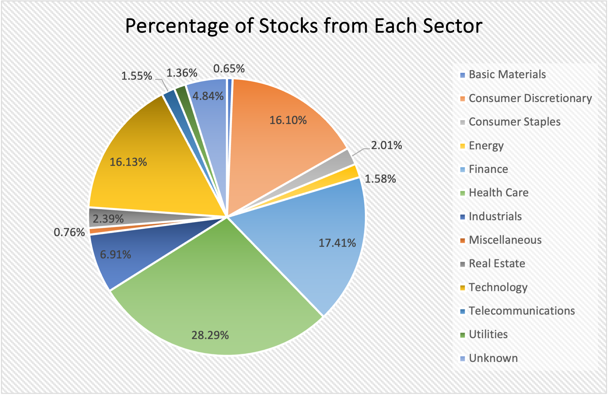

# Spreadsheet Analysis

A little assignment to practice finding data, munging it, and analyzing it in a spreadsheet program.

Replace the contents of this file with a report, as described in the [instructions](./instructions.md).

## 1. Dataset Details
This analysis used [data](https://www.nasdaq.com/market-activity/stocks/screener) of "Global Select" section from Nasdaq screener, *a dataset that contains the stock price, [market cap](https://www.fidelity.com/learning-center/trading-investing/fundamental-analysis/understanding-market-capitalization) (i.e., market value), as well as other basic information about selected stocks all over the world*. The original data was downloaded in **CSV** at Feb 13, 2024. Here is a preview (records 101-120, as it best captures the problem in the dataset)of the downloaded [dataset](./data/nasdaq_screener_20240213.csv):

| **Symbol** | **Name** | **Last Sale** | **Net Change** | **% Change** | **Market Cap**  | **Country** | **IPO Year** | **Volume** |**Sector** | **Industry** |
|:-:|:-:|:-:|:-:|:-:|:-:|:-:|:-:|:-:|:-:|:-:|
|AERTW|Aeries Technology Inc. Warrant|$0.0893|0.0131|17.192%|1394777.00|United States|2021|432|Consumer Discretionary|Professional Services|
|AEYE|AudioEye Inc. Common Stock|$5.30|-0.21|-3.811%|63010910.00|United States||18586|Technology|EDP Services|
|AEZS|Aeterna Zentaris Inc. Common Stock|$1.8506|0.0506|2.811%|8986284.00|Canada||4058|Health Care|Biotechnology: Pharmaceutical Preparations|
|AFAR|Aura FAT Projects Acquisition Corp Class A Ordinary Shares|$11.01|-0.07|-0.632%|0.00|Singapore|2022|4043|Finance|Blank Checks|
|AFBI|Affinity Bancshares Inc. Common Stock (MD)|$16.51|0.00|0.00%|105470982.00|United States|2017|775|Finance|Major Banks|
|AFCG|AFC Gamma Inc. Common Stock|$11.2797|-0.2503|-2.171%|230756685.00|United States|2021|106322|Real Estate|Real Estate Investment Trusts|
|AFIB|Acutus Medical Inc. Common Stock|$0.1835|-0.0144|-7.276%|5377243.00|United States|2020|104888|Health Care|Biotechnology: Electromedical & Electrotherapeutic Apparatus|
|AFJK|Aimei Health Technology Co. Ltd Ordinary Share|$10.18|0.00|0.00%|0.00|United States|2024|5525|||
|AFJKR|Aimei Health Technology Co. Ltd Right|$0.18|-0.0001|-0.056%|0.00|United States|2024|1100|||
|AFMD|Affimed N.V.|$0.5846|-0.0054|-0.915%|87303775.00|Germany|2014|511305|Health Care|Biotechnology: Pharmaceutical Preparations|
|AFRI|Forafric Global PLC Ordinary Shares|$10.39|-0.03|-0.288%|279283200.00|Gibraltar||19884|Consumer Staples|Packaged Foods|
|AFRIW|Forafric Global PLC Warrants|$1.29|-0.06|-4.444%|73374029.00|Gibraltar||15840|Consumer Staples|Packaged Foods|
|AFRM|Affirm Holdings Inc. Class A Common Stock|$40.1226|-4.8774|-10.839%|12312587567.00|United States|2021|12428965|Consumer Discretionary|Business Services|
|AFYA|Afya Limited Class A Common Shares|$20.38|-0.64|-3.045%|1910071275.00|Brazil|2019|18008|Real Estate|Other Consumer Services|
|AGAE|Allied Gaming & Entertainment Inc. Common Stock|$1.12|-0.05|-4.274%|41263783.00|United States|2017|48368|Telecommunications|Cable & Other Pay Television Services|
|AGBA|AGBA Group Holding Limited Ordinary Share|$0.4424|0.0434|10.877%|29889428.00|Hong Kong|2019|247181|Finance|Investment Managers|
|AGBAW|AGBA Group Holding Limited Warrant|$0.019|0.001|5.556%|1283678.00|Hong Kong|2019|11532|Finance|Investment Managers|
|AGEN|Agenus Inc. Common Stock|$0.7521|-0.0572|-7.068%|286922744.00|United States|2000|8232149|Health Care|Biotechnology: Biological Products (No Diagnostic Substances)|
|AGFY|Agrify Corporation Common Stock|$0.6191|-0.0364|-5.553%|1053240.00|United States|2021|254561|Consumer Discretionary|Military/Government/Technical|
|AGIO|Agios Pharmaceuticals Inc. Common Stock|$25.03|-0.85|-3.284%|1398958839.00|United States|2013|234319|Health Care|Biotechnology: Pharmaceutical Preparations|

Notice that "IPO Year," "Sector," and "Industry" columns contain empty entries and the stock with symbol "AFJKR" that has a nonzero stock price and volume but with 0 market cap. The same problem also frequently occurs in other rows of the dataset.

Since a nonzero stock price indicate the stock issuer is valued by some buyers in the market, its issuer should have nonzero market cap. In addition, by the assumption that all stocks in this dataset are available for trading (i.e., has nonzero stock price), all stocks with zero market cap are considered invalid and was removed. This is accomplished by defining a testing function `_is_positive`, which is passed to the function `munge_csv`
and called as `Callable` object `is_valid` when checking given key of the CSV file as valid:
```Python
# Definition of `_is_positive`.
def _is_positive(entry : str) -> bool:
    try:
        return float(entry) > 0
    except Exception:
        return False
```
```Python
# Check if required data is valid, fix if needed.
for (key, is_valid) in req_keys.items():
    # Get index or the given key.
    index = filtered_header[key]

    # Determine if the row should be kept.
    if is_valid(row[index]):
        continue
    if not fix or key not in default_fill:
        invalid_word = True
        break
                
    # Fix invalid data.
    row[index] = default_fill[key]
```

For records with empty entries, since the data for each stock is independent from each other, these missing entries are filled with string `"Unknown"` using `munge_csv` function:
```Python
# Fill in default value.
for key in default_fill:
    # Get index or the given key.
    index = filtered_header[key]

    if row[index] == "":
        row[index] = default_fi[key]
```


## 2. Analysis
### 2.1 Aggregate Statistics
- **Max Sales Price**: This statitics calculates the maximum sales price for stocks in the [dataset](./data/clean_data.csv) using the `MAX` function. It shows that the highest sales price is $3726.64, much higher than the daily consumption of an ordinary person.
- **Max Market Cap**: This statitics calculates the maximum market cap for stocks in the [dataset](./data/clean_data.csv) using the `MAX` function. It shows that the highest market cap is $3,028,014,219,861.00, almost 1/9 of [the US GDP in 2023](https://www.bea.gov/news/2024/gross-domestic-product-fourth-quarter-and-year-2023-advance-estimate) ($27.36 Trillion = $27,360,000,000,000).
- **Average Market Cap**: This statitics calculates the average market cap for stocks in the [dataset](./data/clean_data.csv) using the `AVERAGE` function. It shows that the average market cap of this dataset is about $8,070,732,516.79, which is about "[mid-cap](https://www.businessinsider.com/personal-finance/what-is-market-cap)".
- **Average Fluctuation**: This statitics calculates the average fluctuation in price for stocks in the [dataset](./data/clean_data.csv) using the `AVERAGE` function. A change of -1.78% indicates that the average stock price is relatively stable in the period where the data gets recorded. There might not be news that could change market expectation.

### 2.2 Aggregate Statistics with Conditions
- **Max Sales Price of Each Sector**: This statitics calculates the maximum sales price for stocks from each sector using the `MAXIFS` function with only one citeria (since `MAXIF` is not available in my mac). It shows that the highest sales price happens in the consumer discretionary sector ($3,726.64), being two times more than finance, which has the second place ($1486.09), and three times more than technology ($1245.17).
- **Max Market Cap of Each Sector**: This statitics calculates the maximum market cap for stocks from each sector using the `MAXIFS` function with only one citeria. It shows that the largest market cap comes from the technology sector ($3,028,014,219,861.00), followed by consumer discretionary sector ($1,758,687,526,379.00), while the finance sector surprisingly has a relatively small value ($74,540,145,611.00).
- **Average Market Cap of Each Sector**: This statitics calculates the average market cap for stocks from each sector using the `AVERAGEIF` function. It shows that technology sector has the highest average market cap ($29,894,973,657.80), about two times of telecommunications at the second place ($12,754,124,272.68), and about three times of the consumer discretionary ($8,839,543,542.63).
- **Average Fluctuation of Each Sector**: This statitics calculates the average fluctuation in price for stocks from each sectors as percents using the `AVERAGEIF` function. It shows that, on average, the sales price of stocks in each sector does not change much, but all experienced a slight decrease in price.

### 2.3 Chart
</img>
This pie chart shows the percentage of number of stocks from each sector (frenquency counted using `COUNTIF` function) in the entire munged [dataset](./data/clean_data.csv). It shows that at about 80% of stocks in the dataset come evenly from "Consumer Discretionary," "Finance," "Healthcare," and "Technology" sectors. 

## 3. Extra-credit

This assignment deserves extra credit for **Big or Complex Data** because 
it munged a [dataset](./data/nasdaq_screener_20240213.csv) of **4083** records and analyzed a [dataset](./data/clean_data.csv) of **3676** records.